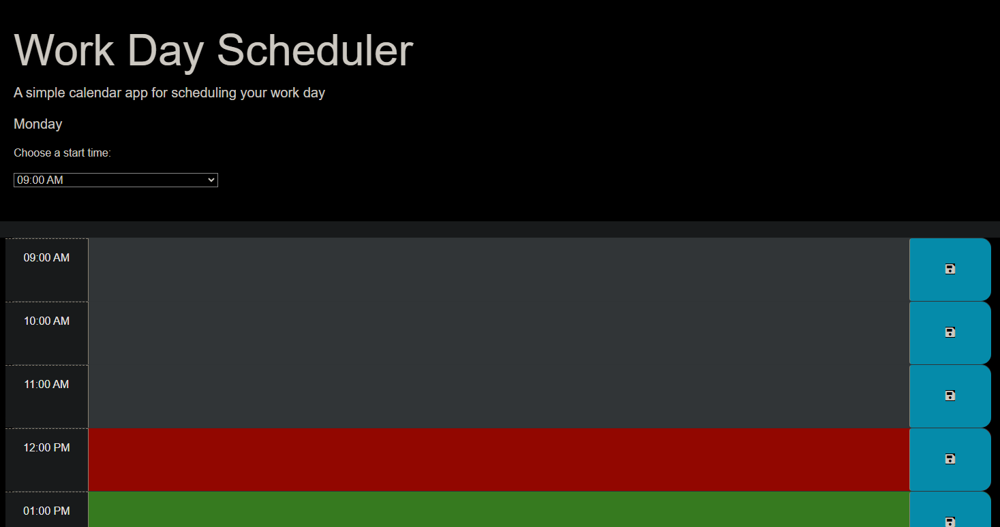

# Work Day Scheduler

## Calendar app to track your appointments for a workday.

Live site: https://alexilson.github.io/Work-Day-Scheduler/

Repo URL: https://github.com/alexilson/Work-Day-Scheduler

## Instructions:

-The calendar will display one time block for each hour.

-You can change your starting time using the dropdown box.

-The calendar will display 9 total time blocks representing one hour each.

-Enter a description into the time block and press the blue Save button to the right of the time block.

-After saving the input, the time block will retain the description when the page reloads.

-To clear out a description on a time block, delete the text and press the save button.

